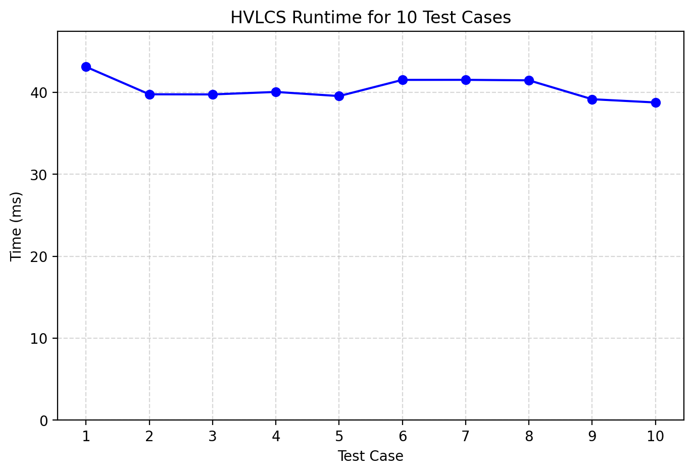

# Programming Assignment 3

**UFIDS**:  
Karla Tran: 89625286  
Daniel Park: 75200264  

# Overview
This assignment uses a Python implementation to find the Highest Value Longest Common Sequence (HVLCS) required in Programming Assignment 3. To get started, clone the repository: https://github.com/danie1park/ProgrammingAssignment3.git

# Instructions
## Dependencies
- Python 3.10+ (tested on 3.10 and 3.11)
- No manual compilation needed
- `matplotlib` is required only for `scripts/benchmark.py`
- It is recommended to use a virtual environment, with the setup below
```bash
# Create virtual environment
python3 -m venv .venv

# Activate (Windows PowerShell/cmd)
.venv\Scripts\activate

# Activate (macOS/Linux)
source .venv/bin/activate
```
Install the benchmark dependency with:

```bash
python3 -m pip install matplotlib
```

## Assumptions
- Input follows the exact assignment format:
  1. integer `K`
  2. `K` lines of `character value`
  3. string `A`
  4. string `B`
- All characters appearing in `A` and `B` are defined in the alphabet.
- The program may output any one optimal common subsequence when multiple solutions exist.
- `example.in` and `example.out` are example input and output files
- the `test1.xx`–`test10.xx` files are examples used for Question 1.

# Questions
## Question 1
**Empirical runtime comparison:**

- Used 10 nontrivial input files in `data/` with string lengths ≥ 25.
- Measured runtime using `scripts/benchmark.py`.
- Generated the runtime graph at `data/benchmark_results.png`.
- We followed the assignment specs and kept it to just graphing the runtime of the 10 files

**How to reproduce:**
1. Run `python3 scripts/benchmark.py` from the project root.
2. View the graph in `data/benchmark_results.png`.



## Question 2
_Give a recurrence that is the basis of a dynamic programming algorithm to compute the
HVLCS of strings A and B. You must provide the appropriate base cases, and explain why
your recurrence is correct._

**Recurrence Equation**:  

$$
\text{OPT}(i, j) =
\begin{cases}
0 & \text{if } i = 0 \\
0 & \text{if } j = 0 \\
\max\big(\text{OPT}(i-1, j),\ \text{OPT}(i, j-1),\ v(a_i) + \text{OPT}(i-1, j-1) \text{ if } a_i = b_j\big) & \text{otherwise}
\end{cases}
$$

where:
- a, b = input strings
- i = indices in string a
- j = indices in string b
- v($a_i$) = value of character at i

**Explanation**:  
The base cases in this problem are the first two lines in the recurrence equation. In the cases that there are not enough characters in either string, there cannot be any matches in characters anymore; thus, the value would be 0.  
As for the last line, this line covers the dynamic programming logic where 3 potential cases can occur:  
1. The current character in strings differs ($a_i \neq b_j$), so the optimal solution excludes the current character.
  - The next potential character in the the solution is in the following characters in string a. Thus, there needs to be recursion on the next character in string `a` through the subproblem `OPT(i-1, j)` to uncover this character.
  - The next potential character in the solution is in the following characters in string b. Thus, there needs to be recursion on the next character in string `b` through the subproblem `OPT(i, j-1)` to uncover this character.
2. The current character in the strings match. (Thus, the condition $a_i = b_j$.) In this case, this character is potentially part of the highest value sequence, so this value is stored and added to solution of the subproblem `OPT(i-1, j-1)`. The other choices are still considered in the characters matching case as potential better solutions may exclude this character, so indepedent recursion for each individual string is continued.

As such, this recurrence captures all potential possibilities, allowing for an optimal solution to be found.

## Question 3
